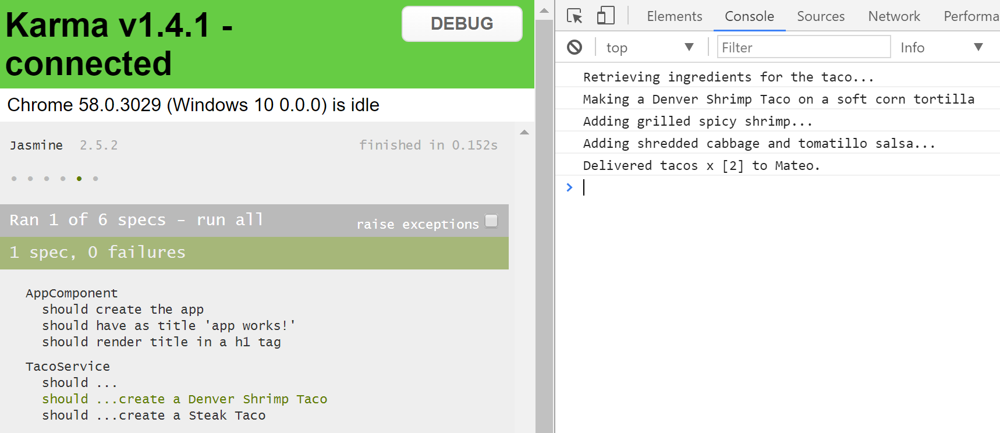

# Design Pattern: Template Method
This application provides a simple implementation of the ` Template Method ` design pattern. The application contains a set of specification tests that demonstrate the pattern. 

Run the following command to execute the pattern:
```
ng test
```

## Template
The ` TacoTemplate ` class provides the template and the method ` execute() ` to create an amazing array of tacos. This class is meant to be an abstract base class for concrete implementations. 

```javascript
export class TacoTemplate {

    quantity: number;
    name: string;
    customer: string;

    execute() {
        this.retrieveIngredients();
        this.selectTacoType();
        this.addFilling();
        this.addToppings();
        this.deliverTaco();
    };

    retrieveIngredients() {
        console.log(`Retrieving ingredients for the taco...`);
    }

    selectTacoType() {
        console.log(`Preparing to select the taco type.`);
    }

    addFilling() {
        console.log(`Preparing to add taco filling.`);
    }

    addToppings() {
        console.log(`Preparing to add taco toppings.`);
    }

    deliverTaco() {
        console.log(`Preparing to deliver ${this.quantity} taco${this.quantity > 1 ? 's' : ''}`);
    }
}
```

### Taco Template Implementation
A nice feature of this pattenr is that you can extend the ` template ` class in another base class and provide default or shared behaviors.

In this example, all tacos by default have the same ` Taco Type ` - due to the implementation of the ` selectTacoTacoType() ` method. All concrete tacos that extend this class will now share this behavior. 

```
import { TacoTemplate } from './taco-template';

export class TacoBase extends TacoTemplate {

    constructor(customer: string) {
        super();
        this.customer = customer;
        this.quantity = 1;
    }

    selectTacoType() {
        // all tacos are made using soft corn torillas...default
        console.log(`Making a ${this.name} on a soft corn tortilla`);
    }

    deliverTaco() {
        console.log(`Delivered tacos x [${this.quantity}] to ${this.customer}.`);
    }
}
```

### Concrete Implementation :: Shrimp Taco
The following ` ShrimpTaco ` class demonstrates the customized implementation of the template methods of the ` TacoTemplate ` base class. 

```javascript
import { TacoBase } from './taco-base';

export class ShrimpTaco extends TacoBase {

    constructor(customer: string, quantity: number = 1) {
        super(customer);
        this.quantity = quantity;
        this.name = 'Denver Shrimp Taco';
    }

    addFilling() {
        console.log(`Adding grilled spicy shrimp...`);
    }

    addToppings() {
        console.log(`Adding shredded cabbage and tomatillo salsa...`);
    }
}
```

### End Result
You can view the output of the ` ShrimpTaco ` by running the specification tests. 

```
ng test
```

The following is the output from one of the concrete implementations of the ` Template Method `.
```
Retrieving ingredients for the taco...
Making a Carne Asada Taco on a soft corn tortilla
Adding tender grilled carne asada...
Adding shredded lettuce and pico de gallo...
Delivered tacos x [4] to Mateo.
```



### More Information

* [www.dofactory.com :: Template Method](http://www.dofactory.com/net/template-method-design-pattern)